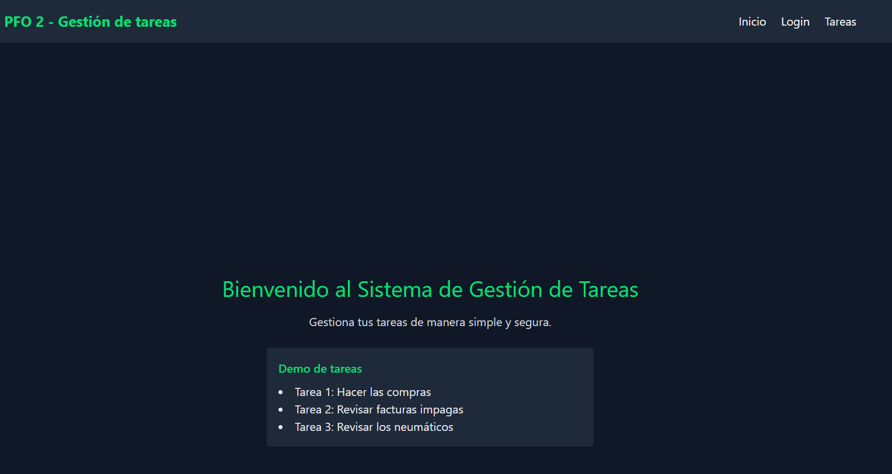
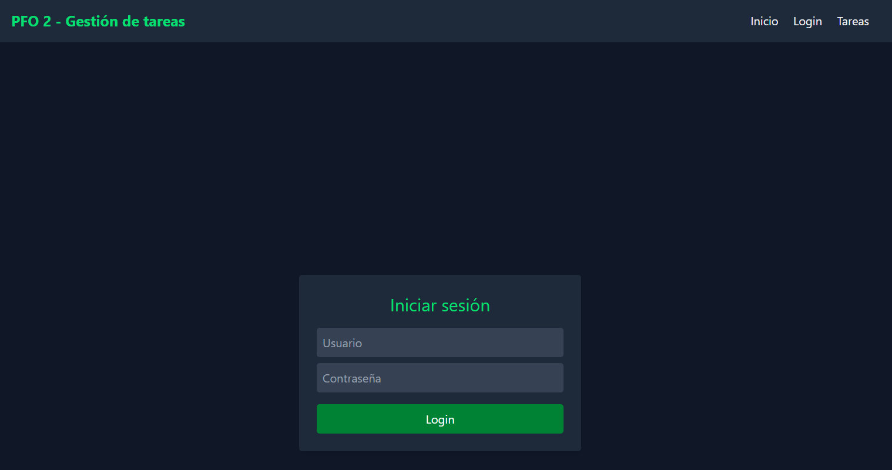
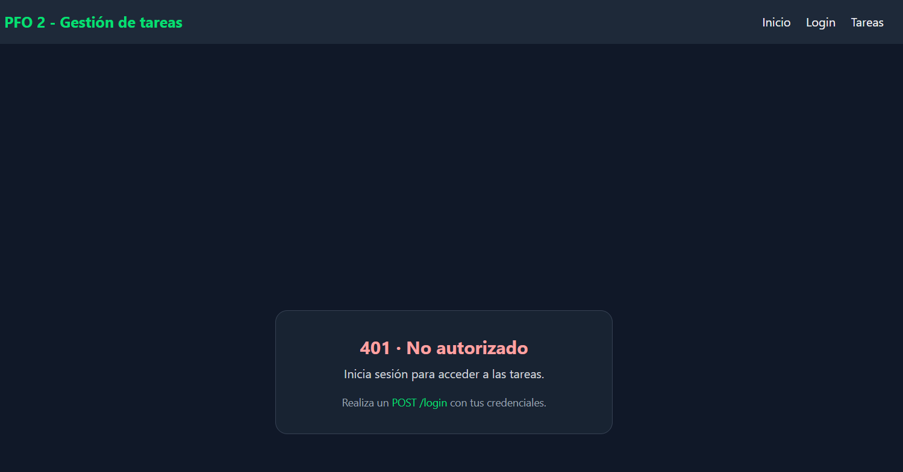
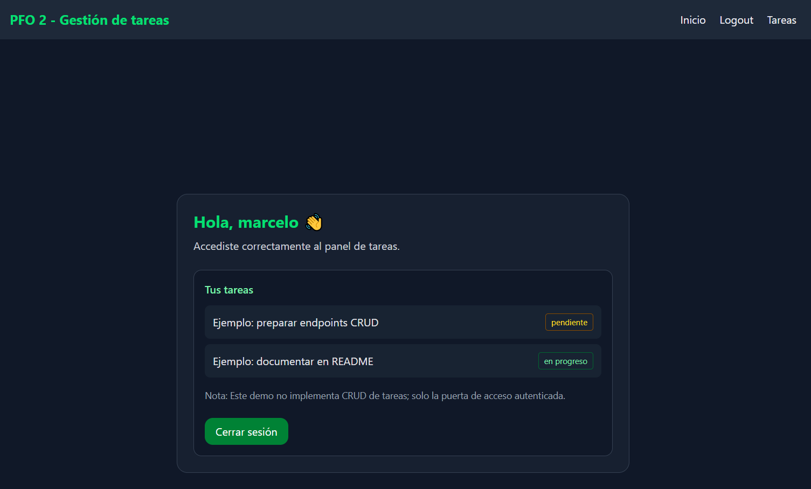
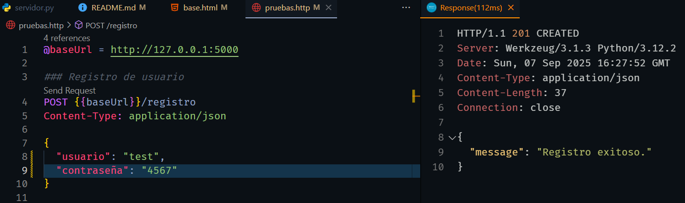
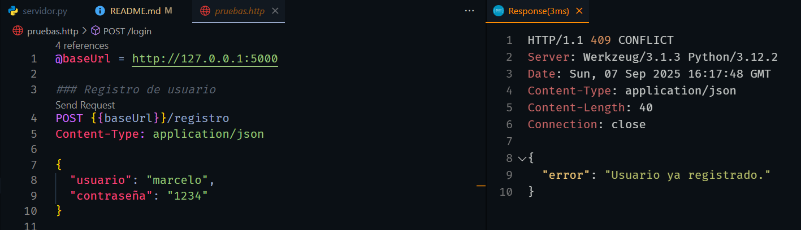
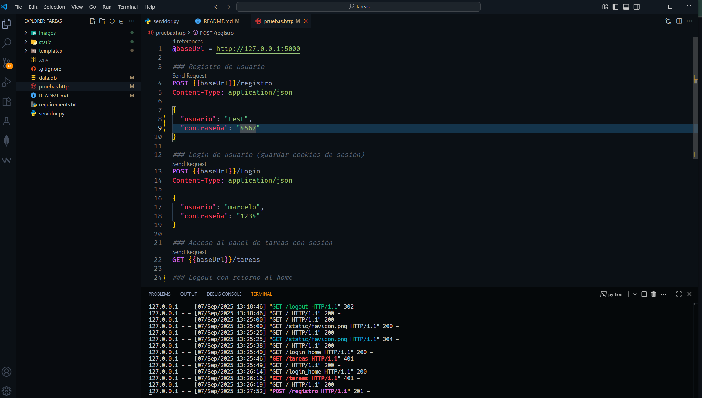

# Sistema de Gestión de Tareas — Flask + SQLite

Este entregable implementa **registro de usuarios**, **inicio de sesión** y un **endpoint protegido** que devuelve un HTML de bienvenida estilizado con **Tailwind** (modo oscuro: grises, negro y verde oscuro).

> **Stack:** Python 3.10+, Flask, SQLite (módulo estándar), `werkzeug.security` para hasheo de contraseñas

## Repositorio

[Github Link](https://github.com/mgalim/tareas-python)

## Endpoints

- `GET /`  
  Página de inicio pública con navegación y footer.

- `GET /login_home`  
  Formulario HTML para iniciar sesión vía POST.

- `POST /login_form`  
  Endpoint que procesa el formulario de login y crea la sesión.

- `POST /registro`

  - Body JSON: `{"usuario": "nombre", "contraseña": "1234"}`
  - Crea un usuario con contraseña **hasheada** (nunca en texto plano).

- `POST /login`

  - Body JSON: `{"usuario": "nombre", "contraseña": "1234"}`
  - Verifica credenciales y crea sesión.

- `GET /tareas`  
  Retorna HTML de bienvenida **solo si** estás autenticado.  
  Si no, entrega una página **401 No Autorizado**.

- `GET /logout`  
  Cierra la sesión y redirige a la página de inicio.

## Ejecución

1. Instalar dependencias:
   ```bash
   pip install -r requirements.txt
   ```
2. Ejecutar el servidor:
   ```bash
   python servidor.py
   ```
3. Abrir en el navegador: `http://127.0.0.1:5000/`

## Configuración de SECRET_KEY

La aplicación Flask requiere un `SECRET_KEY` para firmar cookies de sesión.  
Para simplificar, el proyecto incluye soporte de **python-dotenv**.  
Crea un archivo `.env` en la raíz del proyecto con:

```
SECRET_KEY=dev-secret-1234
```

## Pruebas

Se incluye el archivo **`pruebas.http`** para ser utilizado con el plugin _REST Client_ de VS Code o clientes similares.  
Permite ejecutar los endpoints `/registro`, `/login`, `/tareas` y `/logout` de manera interactiva.
Tambien se puede probar con los template con el formulario de login

**Capturas de pantalla**









## Arquitectura y seguridad

- **Hasheo de contraseñas:** Se utiliza `werkzeug.security.generate_password_hash` y `check_password_hash` para evitar almacenar contraseñas en texto plano.
- **Persistencia:** SQLite (`sqlite3`) con creación de tabla idempotente al inicio.
- **Sesiones:** Basadas en cookie de sesión de Flask con `HttpOnly` y `SameSite=Lax` habilitados.

## Respuestas conceptuales

### ¿Por qué hashear contraseñas?

- **Mitigación de riesgos:** Si la base de datos se filtra, un hash robusto (con sal y costo) dificulta la recuperación de la contraseña original.
- **Buenas prácticas de seguridad:** Evita almacenamiento reversible. `generate_password_hash` usa algoritmos probados (p. ej., PBKDF2).
- **Cumplimiento y reputación:** Alinea con estándares y reduce impacto reputacional ante incidentes.

### Ventajas de usar SQLite en este proyecto

- **Simplicidad operativa:** 0 configuración de servidor; archivo único `.db`.
- **Portabilidad:** Ideal para demos, prototipos y ambientes de desarrollo/educativos.
- **Rendimiento suficiente:** Para cargas bajas y un único proceso, es eficiente.
- **Menor fricción de deployment:** Facilita la evaluación del entregable sin infraestructura adicional.

## Estructura del proyecto

```
Tareas/
├─ servidor.py
├─ requirements.txt
├─ images
├─ static
├─ data.db
├─ .env
├─ pruebas.http
├─ templates/
│  ├─ base.html
│  ├─ home.html
│  ├─ unauthorized.html
│  └─ tareas.html
└─ README.md
```

---
